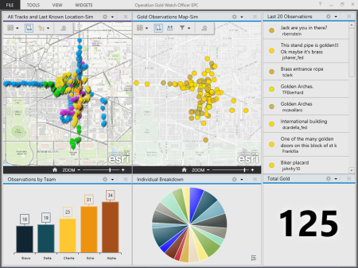

# MilitaryAnalyst-Geoprocessing-Toolbox
is a collection of models, scripts, and tools for use in ArcGIS for Desktop and ArcGIS Pro. This toolbox is one component that is a part of the Military Analyst Product. 

## Features

* [toolboxes]
* TBD 2

## Sections

* [Requirements](#requirements)
* [Instructions](#instructions)
* [Issues](#issues)
* [Contact](#contact)
* [Contributing](#contributing)
* [Resources](#resources)
* [Licensing](#licensing)

## Requirements

* ArcGIS Desktop 10.3.1

## Instructions

* [New to Github? Get started here.](http://htmlpreview.github.com/?https://github.com/Esri/esri.github.com/blob/master/help/esri-getting-to-know-github.html)

### Working with the tools

1. Fork the "dev" branch.
2. Clone it to your local machine
3. Make your changes locally
4. Commit your changes and Sync with your remote
5. Create a Pull Request to have your updates merged to "dev"

## Issues

Find a bug or want to request a new feature?  Please let us know by submitting an [issue]().
Please note that issues might be copied or transferred to other repositories as needed.

### Contact

The primary Point of Contact (POC) for Issues/Contributions to this Repository is:
* (Matt Funk)[https://github.com/mfunk]

Secondary POC:
* (Lyle Wright)[https://github.com/topowright]

## Contributing

Esri welcomes contributions from anyone and everyone. Please see our [guidelines for contributing](https://github.com/esri/contributing).

## Resources

* [Solution's Guide to Creating Geoprocessing Tools](https://github.com/ArcGIS/Solutions-Resources/blob/master/Python/Style/SolutionsGuideToCreatingGeoprocessingTools.md)

### Related repositories
* [solutions-geoprocessing-toolbox](https://github.com/Esri/solutions-geoprocessing-toolbox)
* [solutions-webappbuilder-widgets](https://github.com/Esri/solutions-webappbuilder-widgets)
* [coordinate-tool-addin-dotnet](https://github.com/Esri/coordinate-tool-addin-dotnet)
* [geodesy-and-range-addin-dotnet](https://github.com/ArcGIS/geodesy-and-range-addin-dotnet)

## Licensing

Copyright 2016 Esri

Licensed under the Apache License, Version 2.0 (the "License");
you may not use this file except in compliance with the License.
You may obtain a copy of the License at

   [http://www.apache.org/licenses/LICENSE-2.0](http://www.apache.org/licenses/LICENSE-2.0)

Unless required by applicable law or agreed to in writing, software
distributed under the License is distributed on an "AS IS" BASIS,
WITHOUT WARRANTIES OR CONDITIONS OF ANY KIND, either express or implied.
See the License for the specific language governing permissions and
limitations under the License.

A copy of the license is available in the repository's
[license.txt](license.txt) file.

