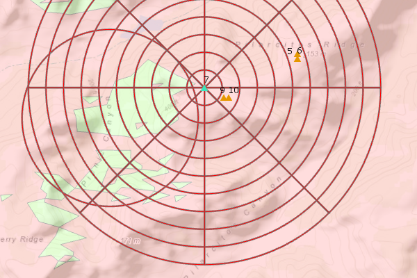

# military-tools-geoprocessing-toolbox
is a collection of models, scripts, and tools for use in ArcGIS for Desktop and ArcGIS Pro. This toolbox is one component that is a part of the Military Tools Product. 

## Sections
* [Features](#features)
* [Requirements](#requirements)
* [Instructions](#instructions)
* [Issues](#issues)
* [Contact](#contact)
* [Contributing](#contributing)
* [Resources](#resources)
* [Licensing](#licensing)

## Features

This is an ArcGIS Geoprocessing Toolbox that contains collections of tools to import geometry from tables, determine ranges, and provide basic visibility analysis capabilities.

### Contents
* [toolboxes](./toolboxes)
	* Military Tools.tbx (same tools as below)
	* Military Tools_10.3.tbx
		* Conversion
			* Convert Coordinates
			* Table To 2-Point Line
			* Table To Ellipse
			* Table To Line Of Bearing
			* Table To Point
			* Table To Polygon
			* Table To Polyline
		* Distance and Direction
			* Range Rings (from Interval)
			* Range Rings from Minimum Maximum
			* Range Rings from Minimum Maximum Table
		* Source Scripts
			* Add Unique Row ID
			* Polyline To Polygon
			* sourceCC
			* sourceRLOSscript
		* Visibility
			* Add Observer Fields (ArcGIS Pro only)
			* Linear Line Of Sight
			* Radial Line Of Sight
			* Find Local Peaks
			* Highest Points
			* Lowest Point
	* [scripts](./toolboxes/scripts)
		* AddUniqueRowID.py
		* ConvertCoordinates.py
		* PolylineToPolygon.py
		* RangeRingsUtils.py
		* RangeRingFromMinMaxTable.py
		* RangeRingMinMax.py
		* RangeRingsFromInterval.py
		* RLOS.py
	* [layers](./toolboxes/layers)
		* Highest Point Output.lyr
		* Linear Line of Sight Output.lyr
		* Lowest Point Output.lyr
		* Radial Line Of Sight Output.lyr
		* RangeRadials.lyr
		* RangeRingInputObserver.lyr
		* RangeRings.lyr
	* [tooldata](./toolboxes/tooldata)
		* [Range Rings.gdb]
			* rrInputTable
* [testdata](./testdata)
	* DataCreditsforMilitaryToolsGeoprocessingToolbox.txt
	* USGS SRTMData Citation_1.pdf
	* [MilitaryToolsTestData.gdb]
		* ElevationSurface - surface data
		* sampleRangePoints- sample point test data
		* SigActs - event and coordinate test data 
		* [SRTM30M]
			* 36.dt2
		* [SRTM90M]
			* [dted]
				* [w121]
					* n35.dt1
					* n36.dt1
				* [w122]
					* n35.dt1
					* n36.dt1
				* [w123]
					* n36.dt1

## Requirements

* ArcGIS Desktop 10.3.1 and Python 2.7
* ArcGIS Pro 1.3 and Python 3.4

Requires Spatial Analyst:

* Find Local Peaks
* Highest Points
* Lowest Points
* Radial Line Of Sight

Requires Spatial Analyst and 3D Analyst:

* Linear Line Of Sight

## Instructions

* [New to Github? Get started here.](http://htmlpreview.github.com/?https://github.com/Esri/esri.github.com/blob/master/help/esri-getting-to-know-github.html)

## Issues

Find a bug or want to request a new feature?  Please let us know by submitting an [issue](https://github.com/Esri/military-tools-geoprocessing-toolbox/issues).
Please note that issues might be copied or transferred to other repositories as needed.

1. Use a concise, one-line title
2. The Description should include:
	* A *detailed* description of what the problem or question is, what was expected, what differed.
	* A *numbered* list of steps to reproduce the problem (don't assume the person fixing the issue will know how to reproduce the problem)
	* Screenshots are helpful
	* blocks of script/code (if necessary)

## Contributing

Esri welcomes contributions from anyone and everyone. Please see our [guidelines for contributing](https://github.com/esri/contributing).

### Repository Points of Contact

Repository Owner: [Matt Funk](https://github.com/mfunk)
* Merge Pull Requests
* Creates Releases and Tags
* Manages Milestones
* Manages and Assigns Issues

Secondary Contact: [Lyle Wright](https://github.com/topowright)
* Backup when the Owner is away

## Resources

* [ArcGIS 10.3 Help](http://resources.arcgis.com/en/help/)
* [ArcGIS Blog](http://blogs.esri.com/esri/arcgis/)
* [@EsriDefense](http://twitter.com/EsriDefense)
* [ArcGIS Solutions Website](http://solutions.arcgis.com/military/)

### Related repositories
* [solutions-geoprocessing-toolbox](https://github.com/Esri/solutions-geoprocessing-toolbox)
* [solutions-webappbuilder-widgets](https://github.com/Esri/solutions-webappbuilder-widgets)
* [coordinate-conversion-addin-dotnet](https://github.com/Esri/coordinate-conversion-addin-dotnet)
* [distance-direction-addin-dotnet](https://github.com/Esri/distance-direction-addin-dotnet)

## Licensing

Copyright 2016 Esri

Licensed under the Apache License, Version 2.0 (the "License");
you may not use this file except in compliance with the License.
You may obtain a copy of the License at

   [http://www.apache.org/licenses/LICENSE-2.0](http://www.apache.org/licenses/LICENSE-2.0)

Unless required by applicable law or agreed to in writing, software
distributed under the License is distributed on an "AS IS" BASIS,
WITHOUT WARRANTIES OR CONDITIONS OF ANY KIND, either express or implied.
See the License for the specific language governing permissions and
limitations under the License.

A copy of the license is available in the repository's
[license.txt](license.txt) file.

